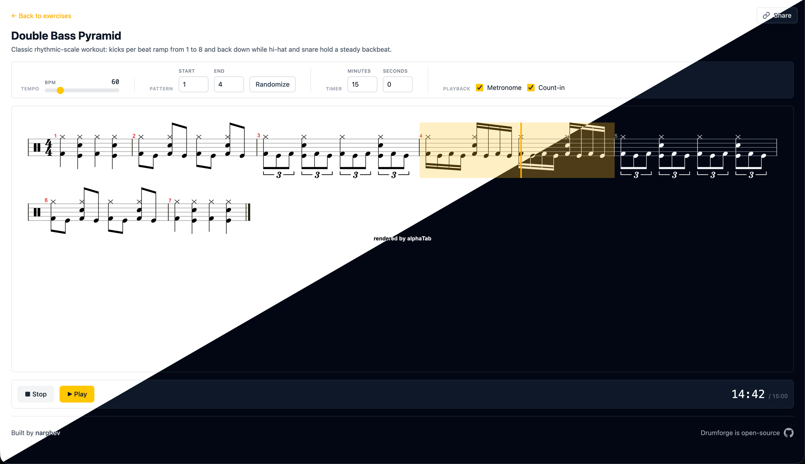

# Drumforge

A free, browser-based interactive drum exercise website with synchronized scrolling notation, configurable BPM, randomization, metronome, count-in, and a built-in practice timer.

🥁 **[drumforge.app](https://drumforge.app)**

## Exercises

- **Double Bass Pyramid** — climb 1 to 8 kicks per beat and back down again, alternating right and left foot.
- **Double Bass Rudiments** — apply classic stickings (singles, doubles, paradiddles, inverted paradiddles) to the feet, with an optional money-beat layer on top.

## Features

- Synced scrolling notation
- BPM slider, metronome, and count-in
- Practice timer
- Randomization mode
- Shareable URLs — every config knob round-trips through query parameters, so a copy-pasted link reproduces the exact setup

## Special thanks

Drumforge stands entirely on the shoulders of **[alphaTab](https://github.com/CoderLine/alphaTab)** — an open-source music-notation rendering and playback library that does the actual heavy lifting of turning text into engraved drum scores with synchronized audio.

## Contributing

Bug reports, exercise suggestions, and PRs are welcome. See **[CONTRIBUTING.md](./CONTRIBUTING.md)** for local setup, architecture notes, and how to add a new exercise.

## License

Copyright © 2026 Narek Ghevandiani. Released under the [MIT License](./LICENSE).

The `@coderline/alphatab` dependency is MPL-2.0; consuming it via npm without modifying its source files is compatible with this project's MIT license.
